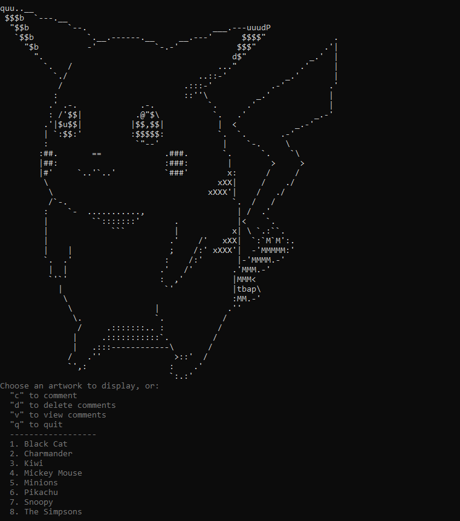

# ASCII ART

Build a state of the (ASCII) art terminal client. Don't forget to maximise your terminal window on one screen. You'll need the space!

When complete, your application might look like this:



## Cloning and branching
- Clone this repo and create a new branch for yourself. Have fun adding some more cool and fun Ascii arts :smile:
  <details style="padding-left: 2em">
    <summary>Tip</summary>

    - Run your app with `npm start` 
    - You can add more functionality in `index.js` 
    
  </details>
---
## Terminal helpers

Writing programs for the terminal might be a new experience for some. My advice is to keep it really simple at first.

<details>
  <summary>About <code>readline</code></summary>

  Something you may find is that you need a way to wait for input from the terminal, for example when choosing which file to display. `readline`, which comes with the Node standard library, will let you pause your program until the user hits enter, then call whatever function you want:

  ```js
  const readline = require('readline')

  function pressEnter () {
    const rl = readline.createInterface({
      input: process.stdin,
      output: process.stdout
    })

    rl.question('Which file should I load? ', function (input) {
      rl.close()

      // Call any functions you like here. For example:
      loadFile(input)
    })
  }
  ```  
</details>

<details>
  <summary>About <code>prompt</code></summary>

  Here is an example of how you might use `prompt` npm package for input:

  ```js
  const prompt = require('prompt')

  prompt.message = ''
  prompt.delimiter = ': '
  prompt.start()

  const choice = {
    name: 'option',
    hidden: false,
    message: '' // Write your prompt message here
  }

  prompt.get(choice, function (err, result) {
    // Do something with result.choice here...
  })
  ```

  The callback you pass to `prompt.get` will receive an object that has a property with the name of your input, so for example:

  ```js
  {
    option: '1'
  }
  ```
</details>
